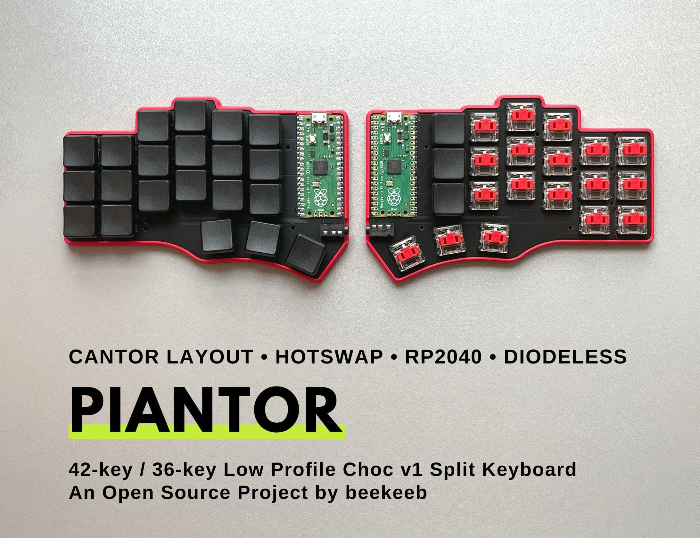
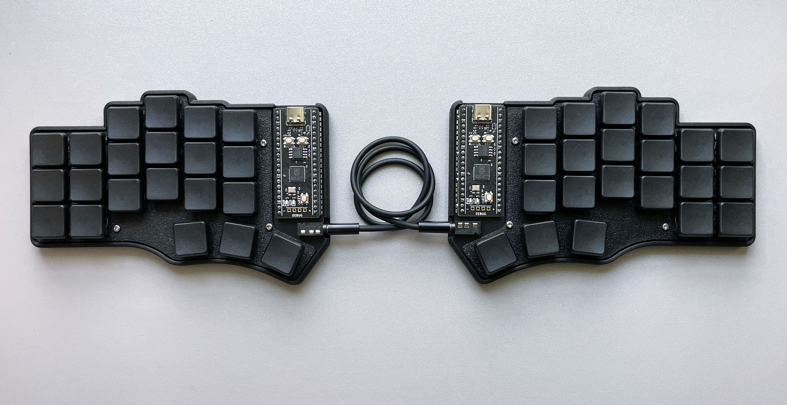
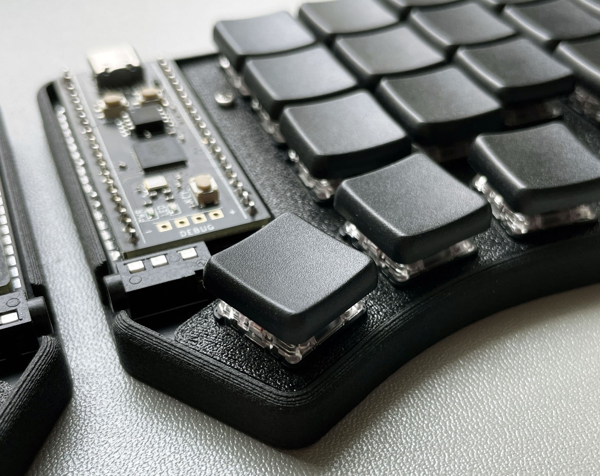
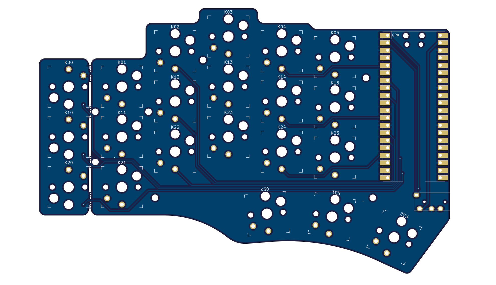
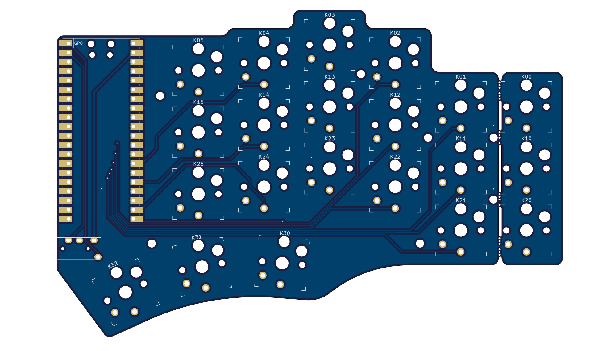
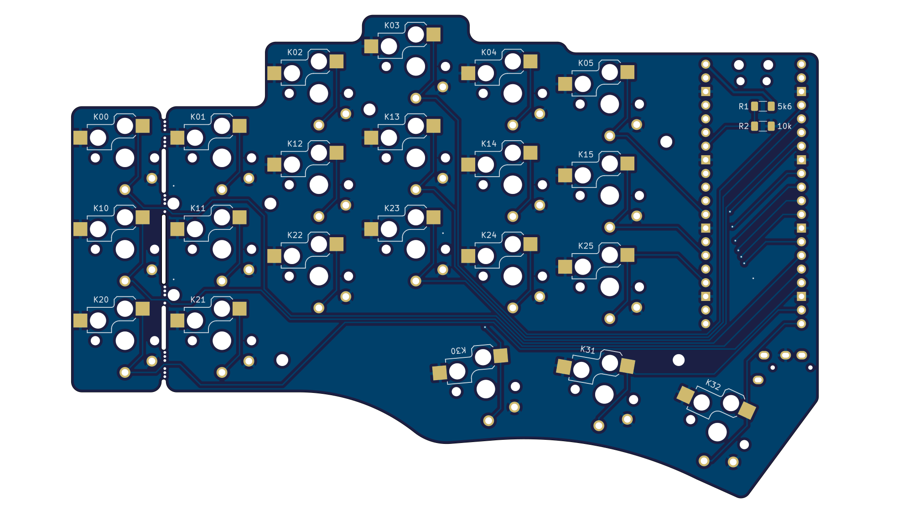
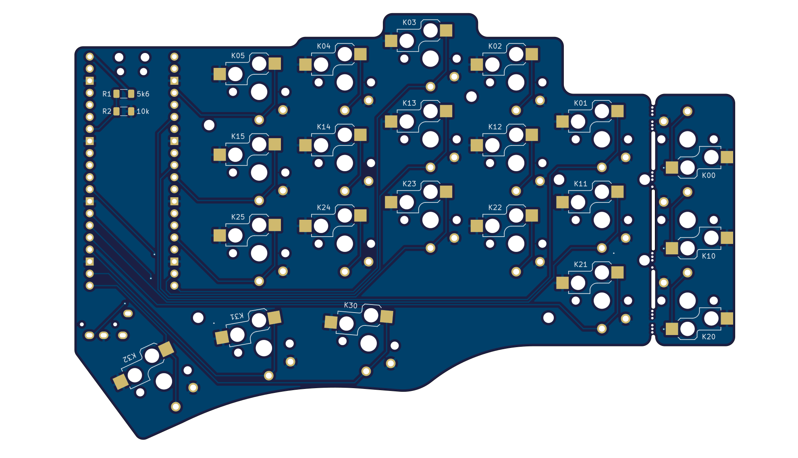

# Piantor Keyboard

The Piantor Keyboard is a 42-key or 36-key wired, diodeless, non-flippable, low profile choc v1 (hybrid hotswap and non-hotswap/soldered-in), aggressive column staggered, programmable ergonomic mechnical split keyboard powered by Rasyberry Pi Pico or other compatible RP2040 boards. It is based on the [Cantor Keyboard](https://github.com/diepala/cantor). The name "Piantor" is the portmanteau of "Pico" and "Cantor".

The development of this project is sponsored by [PCBWay](https://pcbway.com/g/beekeeb) (affiliate link).

## Quick Links

* [Build guide](https://docs.beekeeb.com/piantor-keyboard#build-guide)
* [Precompiled firmware](https://docs.beekeeb.com/piantor-keyboard#precompiled-firmware)
* [beekeeb showcase](https://showcase.beekeeb.com/piantor-keyboard/)

## Features

* RP2040 MCU - A low-cost, easy-to-source, powerful microcontroller with dual Arm Cortex-M0+ @ 133MHz, 264kB on-chip SRAM and 2MB (up to 16MB, depending on the breakout board) off-chip external flash memory. You can enable a lot of features and layers. Never worry about the firmware size limit.
* Cantor layout - Ergonomic strong column staggering for short pinkies.
* Non-flippable PCBs - Fewer ways to make mistakes when you install the controller breakout boards. Great for first time keyboard builders.
* Diodeless - A more robust build with fewer things to solder or break.
* Hybrid hotswap and soldered-in low profile choc switches - Experiment with different key switches with the hotswap sockets, or solder the key switches for a more stable build.
* Breakable pinky column - Easily convert the PCB from a 42-key to 36-key layout. You can snap off the pinky column without specialized tools.

## Bill of Materials (BOM)

Quantity | Item | Notes
--- | --- | ---
1 | Piantor PCB (Left)
1 | Piantor PCB (Right)
2 | RP2040 breakout boards (such as Raspberry Pi Pico or WeAct RP2040)
42 (or 36) | Kailh choc v1 PG1350 switches
42 (or 36) | "choc spacing" choc v1 keycaps
2 | TRRS jack (PJ-320A)
1 | 3.5mm TRRS cable | TRS cable cannot be used
42 (or 36) | CPG135001S30 hotswap sockets for choc v1 PG1350 | Optional, you can solder the switches directly if you do not use hotswap sockets
4 | Pin headers (20p) or sockets  | Only required for boards without castellated holes
2 | 10kΩ 1206 (3216M) SMD resistor | Only required if you do not want to use SPLIT_USB DETECT, and for boards without a built in VBUS_SENSE circuit
2 | 5.6kΩ 1206 (3216M) SMD resistor | Only required if you do not want to use SPLIT_USB DETECT, and for boards without a built in VBUS_SENSE circuit

* Note: Raspberry Pi Pico comes with castellated holes and a built in VBUS_SENSE circuit

## Ordering Parts

[DIY kits](https://shop.beekeeb.com/product/piantor-keyboard-kit/) and [prebuilt keyboards](https://shop.beekeeb.com/product/pre-soldered-piantor-split-keyboard/) are available at https://beekeeb.shop

If you prefer getting the parts by yourself, you can order the [Left Side PCB](https://www.pcbway.com/project/shareproject/Piantor_Keyboard_Left_side_24a2937f.html) and the [Right Side PCB](https://www.pcbway.com/project/shareproject/Piantor_Keyboard_Right_side_7c5b31eb.html).

A single side should cost around $31 for 5 pcs excluding shipping. For both sides, it should be around $62 in total for 5 sets.

## Firmware Status

* [QMK](https://github.com/qmk/qmk_firmware) - supported
* [Vial](https://github.com/beekeeb/vial-qmk-piantor) (based on QMK) - supported
* KMK (Python/CircuitPython) - pull request at https://github.com/KMKfw/kmk_firmware/pull/723
* [An example of KMK with miryoku](https://github.com/hansamann/piantor_miryoku_mac) by [hansamann](https://github.com/hansamann) (**this firware requires an older version of kmk from 2022 [repo link](https://github.com/KMKfw/kmk_firmware/tree/b3ec37e2746a854a320e13b1be7823f7902aa658)**)
* Remap - support planned (No ETA)
* PRK (Ruby) - support planned (No ETA)
* keyberon (Rust) - support planned (No ETA)
* ZMK - waiting for [wired split support](https://github.com/zmkfirmware/zmk/issues/1110)

Precompiled firmware can be found at https://docs.beekeeb.com/piantor-keyboard.

## Cases

* [Piantor Gasket Mount Case by chewiedies](https://www.printables.com/model/536044-piantor-gasket-mount-case)
* [Piantor 36-key case with Tenting & Magnets! by Daave](https://www.printables.com/model/381730-piantor-36-key-case-with-tenting-magnets)
* [Travel case for Piantor keyboards by Rilton](https://www.printables.com/model/558902-travel-case-for-piantor-keyboards)

### Piantor Case with a Switch Plate (3D Printable)

The 3D printable case can be founded in the [case folder](./case). The switch plate is optional for the non-hotswap version.

GB823 M2 stainless steel screws with small pan heads are recommended.

* Screw Length
  * No switch plates: 4mm
  * With Switch plates: 6mm
  * With Switch plates and [Donut0804](https://shop.beekeeb.com/product/donut-silicone-rubber-feet-and-pads-o-rings-washers-like/)/o-rings: 7mm

Do not over-tighten the screws.

### Cantor Tray Case

The [Cantor Tray Case](https://www.thingiverse.com/thing:5382705) by chewiedies can be used. There is not a switch plate so it is not recommended for the hotswap version.

## Boards Preview

## License

External symbols and footprints are not covered by the LICENSE in this repo.

* [Keebio-Parts.pretty](https://github.com/keebio/Keebio-Parts.pretty) is licensed under the MIT License.
* [keyswitches.pretty](https://github.com/daprice/keyswitches.pretty) is licensed under the Creative Commons Attribution-ShareAlike 4.0 International License.
* [KiCad-RP-Pico](https://github.com/ncarandini/KiCad-RP-Pico) is licensed under the TPCWare KiCad Library License.
## Sponsors

This open source hardware project is sponsored by

